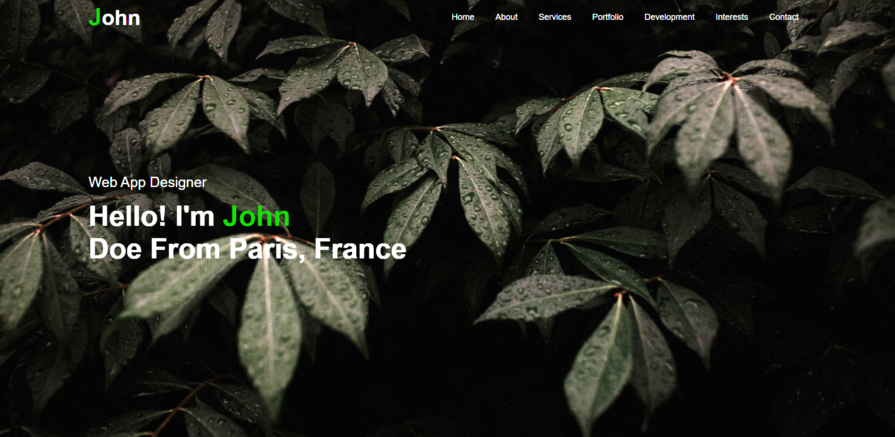

# Portfolio Website Template

## Introduction

Hello! 

This is a template for a simple portfolio website built with HTML, CSS, and a bit of JavaScript. You can view a live demo [here.](https://a-gold-steak.github.io/home-lab_active-directory/#){:target="_blank"} The site is completely customizable to your liking. Want to send your website to a friend so they can have a good look over it? Great news! This website is also optimized for [mobile devices.](https://a-gold-steak.github.io/portfolio-website-template/mobile-screenshot.png){:target="_blank"} Read on to see how to adapt this project, the website's features, and how to deploy the site.

## Adapting This Project
This website can be easily edited to your liking. I recommend downloading all the assets by heading to *<>Code -> Download Zip.* You would then extract the files and open them in your code editor of choice. As for the code editor, you can use pretty much anything but my favorite editors for Windows are <a href="https://code.visualstudio.com/" target="_blank">Visual Studio Code</a> or [Sublime Text.](https://www.sublimetext.com/){:target="_blank"}. As for the Linux users, my favorite text editor to use is [vim.](https://www.educba.com/vim-command-in-linux/){:target="_blank"} 

## Template Features
This template contains the following easy-to-edit sections. Again this isn't completely exclusive, feel free to add more sections or even take some away!
- About Me
- Services you offer
- A section to display personal projects or pieces of work
- A "in-development" section that can be used to display progress in a piece of work or project
 - This section can also be used to display your progress in a skillset!(e.g. Python, AWS)
- A section to show personal hobbies or interests
- Contact Me information

## Deploying the Website
There are plenty of methods to deploy a website to the web. A free method is to use [GitHub Pages](https://www.youtube.com/watch?v=p1QU3kLFPdg){:target="_blank"} or my personal favorite is using [AWS.](https://www.youtube.com/watch?v=lCnymxddies&list=PLzyuJoT90aSv8zmW5pxV1IJ_VWDfVhVFN&index=9){:target="_blank"}

Whichever method you decide to go with, you should be able to have the site up and running in less than an hour with the above tutorials. Good luck!

## Other Notes 
- The website icons I used can be obtained from the following [site.](https://fontawesome.com/icons){:target="_blank"}
- Free to use stock images can be obtained from [here.](https://www.pexels.com/){:target="_blank"} 

# Acknowledgements
I would like to thank the following sources for the help and the inspiration for this project.
- [EasyTutorials](https://www.youtube.com/@EasyTutorialsVideo/videos){:target="_blank"}
- [Free Frontend](https://freefrontend.com/){:target="_blank"}
- [W3Schools HTML](https://www.w3schools.com/html/default.asp){:target="_blank"}
- [W3Schools CSS](https://www.w3schools.com/css/default.asp){:target="_blank"}
- [W3Schools JS](https://www.w3schools.com/js/default.asp){:target="_blank"}

